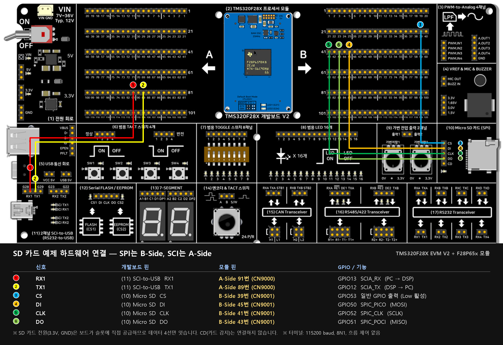

# Micro SD 카드 (SPI) 대화형 콘솔 — TMS320F28P65x DriverLib

SyncWorks TMS320F28X 개발보드 V2의 **(10) Micro SD 카드 슬롯(SPI)** 및 **(11) 2채널 SCI-to-USB 브리지**를 활용하여 FAT16/FAT32 파일시스템을 마운트하고, PC 시리얼 터미널에서 대화형 명령어로 SD 카드의 파일 및 디렉터리를 조작하는 **완전한 자기완결형(Self-contained) 예제 프로젝트**입니다.

F28388D 레퍼런스 예제의 검증된 대화형 쉘 사용자 경험을 최신 C2000 듀얼코어 MCU인 **TMS320F28P65x 공식 DriverLib** 환경으로 완벽하게 이식·최적화하였습니다.

---

## 1. 하드웨어 배선 가이드



### 1.1 (10)번 구역 Micro SD 카드 슬롯 (SPI) ↔ F28P65x 모듈 (B-Side CN9001)

EVM V2 보드 우측의 **(10) Micro SD 카드** 헤더 4핀과 F28P65x 프로세서 모듈의 **B-Side(CN9001)** 핀-헤더를 점퍼 와이어로 연결합니다:

| EVM V2 (10) SD 슬롯 핀 | 신호 명칭 | F28P65x 모듈 핀 (B-Side CN9001) | 내부 GPIO 번호 | DriverLib Pin Mux | 신호 설명 |
|---|---|---|---|---|---|
| **DI** | MOSI (Data In) | **B-Side Pin 45** | `GPIO50` | `GPIO_50_SPIC_PICO` | SPI Master Out Slave In |
| **DO** | MISO (Data Out) | **B-Side Pin 43** | `GPIO51` | `GPIO_51_SPIC_POCI` | SPI Master In Slave Out |
| **CLK** | SPICLK | **B-Side Pin 41** | `GPIO52` | `GPIO_52_SPIC_CLK` | SPI 직렬 클록 |
| **CS** | Chip Select | **B-Side Pin 39** | `GPIO53` | GPIO Output | SD 카드 활성화 (Active Low) |

> 💡 **주의**: SD 카드 전원(3.3V 및 GND)은 보드 내부에서 슬롯에 직접 공급되므로 데이터 4선(`DI`, `DO`, `CLK`, `CS`)만 1:1로 연결하시면 됩니다.

### 1.2 (11)번 구역 SCI-to-USB 콘솔 ↔ F28P65x 모듈 (A-Side CN9000)

PC 터미널과의 대화형 통신을 위해 EVM V2 보드의 **(11) SCI-to-USB** 블록과 F28P65x 프로세서 모듈의 **A-Side(CN9000)** 핀-헤더를 연결합니다:

| EVM V2 (11) SCI-to-USB 핀 | 신호 방향 | F28P65x 모듈 핀 (A-Side CN9000) | 내부 GPIO 번호 | DriverLib Pin Mux | 설명 |
|---|---|---|---|---|---|
| **RX1** | PC → DSP 수신 | **A-Side Pin 91** | `GPIO13` | `GPIO_13_SCIA_RX` | SCI-A 수신 데이터 |
| **TX1** | DSP → PC 송신 | **A-Side Pin 89** | `GPIO12` | `GPIO_12_SCIA_TX` | SCI-A 송신 데이터 |

- (11) 구역의 Mini-B 5핀 USB 커넥터를 PC와 연결하면 가상 COM 포트가 생성됩니다.
- 시리얼 터미널(Tera Term, PuTTY, CCS Terminal 등)을 열고 해당 COM 포트로 접속합니다:
  - **Baud Rate**: `115200`
  - **Data Bits**: `8`
  - **Parity**: `None`
  - **Stop Bits**: `1`
  - **Flow Control**: `None`

---

## 2. SD 카드 준비 사항

1. **용량 및 규격**: Micro SD 또는 Micro SDHC (권장: 4GB ~ 32GB)
2. **파일시스템 형식**: **FAT32** 또는 **FAT16** (exFAT나 NTFS는 미지원)
   - PC에서 SD 카드를 우클릭 > [포맷] 선택 후 파일 시스템을 `FAT32`로 포맷해 주세요.
3. 포맷 후 테스트용 텍스트 파일(예: `readme.txt`)을 SD 카드 루트 경로에 복사해 두면 `cat` 명령어로 즉시 읽기 동작을 확인할 수 있습니다.

---

## 3. 대화형 명령어 가이드

보드 전원을 켜거나 리셋하면 아래와 같은 웰컴 배너가 터미널에 표시됩니다:

```text
======================================================
 TMS320F28P65x Micro SD Card SPI Interactive Console  
 SyncWorks EVM V2 Area (10) Micro SD + Area (11) SCI  
======================================================
Type 'help' or '?' for command list.
SD Card mounted successfully.

/> 
```

프롬프트 `/> `에서 다음과 같은 명령어를 입력할 수 있습니다:

| 명령어 | 형식 | 설명 | 사용 예시 |
|---|---|---|---|
| `help`, `h`, `?` | `help` | 사용 가능한 명령어 목록 출력 | `help` |
| `ls` | `ls` | 현재 디렉터리의 파일/폴더 목록, 크기, 남은 용량 표시 | `ls` |
| `pwd` | `pwd` | 현재 작업 디렉터리 경로 출력 | `pwd` |
| `cd`, `chdir` | `cd <path>` | 작업 디렉터리 이동 (`..` 상위 폴더, `/` 루트) | `cd logs`, `cd ..` |
| `cat` | `cat <file>` | 텍스트 파일 내용을 터미널에 출력 | `cat readme.txt` |
| `write` | `write <file> <text>` | 파일에 텍스트 쓰기 (파일 없으면 신규 생성) | `write log.txt hello world 123` |
| `mkdir` | `mkdir <dir>` | 새로운 하위 디렉터리 생성 | `mkdir data` |
| `rm` | `rm <target>` | 지정한 파일 또는 빈 디렉터리 삭제 | `rm log.txt` |

### 사용 예시 세션

```text
/> ls

 Directory of /

  -A---  2026/09/17  12:00        128  README.TXT

     1 File(s),        128 bytes total
     0 Dir(s),    15286272 KB free

/> cat README.TXT
Hello from TMS320F28P65x!

/> write test.txt This is an SPI SD card test for EVM V2.
Successfully wrote 45 bytes to test.txt

/> ls

 Directory of /

  -A---  2026/09/17  12:00        128  README.TXT
  -A---  2026/09/17  12:01         45  TEST.TXT

     2 File(s),        173 bytes total
     0 Dir(s),    15286240 KB free

/> cat test.txt
This is an SPI SD card test for EVM V2.

/> mkdir mydir
Directory created: mydir

/> cd mydir
/mydir> pwd
/mydir

/mydir> cd ..
/> 
```

---

## 4. 소프트웨어 구조 및 아키텍처

```text
10_SD_Card_SPI_Driverlib/
├── CCS/
│   └── 10_SD_Card_SPI_Driverlib.projectspec   # CCS 프로젝트 임포트 명세서
├── device/                                    # F28P65x DriverLib 전체 헤더 및 디바이스 소스
├── fatfs/                                     # ChaN FatFs 파일시스템 엔진 (C28x 포팅)
│   ├── ff.c / ff.h                            # FAT 파일시스템 알고리즘 코어
│   ├── diskio.h                               # 디스크 I/O 함수 인터페이스 선언
│   └── integer.h                              # C28x용 정수형 매핑
├── utils/                                     # 대화형 쉘 및 시리얼 I/O 유틸리티
│   ├── cmdline.c / cmdline.h                  # 명령행 파서 및 토큰 분할기
│   ├── uartstdio.c / uartstdio.h              # F28P65x DriverLib SCI-A 콘솔 드라이버
│   └── ustdlib.c / ustdlib.h                  # 경량 포맷팅 및 문자열 함수
├── 10_SD_Card_SPI_Driverlib.c                 # Main 루프, 콘솔 명령어 핸들러, SysTick ISR
├── mmc_F28P65x.c                              # F28P65x SPI-C 기반 저수준 SD 카드 드라이버
├── driverlib.lib                              # F28P65x DriverLib 사전 빌드 라이브러리
├── 28p65x_generic_ram_lnk_cpu1.cmd            # RAM 디버깅 링커 커맨드 파일
├── 28p65x_generic_flash_lnk_cpu1.cmd          # Flash 독립 실행 링커 커맨드 파일
└── targetConfigs/TMS320F28P650DK9.ccxml       # JTAG 타깃 에뮬레이터 설정
```

### 핵심 모듈 동작 원리

1. **저수준 SD 카드 드라이버 (`mmc_F28P65x.c`)**:
   - SD 카드 전압 협상 및 초기화 단계에서는 400kHz 저속 클록으로 CMD0(Reset), CMD8(Voltage check), ACMD41(Initialization)을 순차 전송합니다.
   - 초기화가 성공적으로 완료되면 12.5MHz 고속 SPI 클록으로 자동 전환하여 읽기/쓰기 성능을 극대화합니다.
   - C28x 아키텍처의 16비트 워드 특성에 맞춰 8비트 SPI 바이트 송수신 및 버퍼 패킹을 완벽하게 처리합니다.
2. **시스템 타이머 (CPUTimer0 SysTick)**:
   - CPUTimer0을 100Hz(10ms 주기) 인터럽트로 구동하여 `disk_timerproc()`을 호출합니다.
   - SD 카드의 명령어 응답 대기 및 데이터 블록 쓰기 완료 타임아웃을 하드웨어 타이머 기반으로 정확하게 측정합니다.
3. **SCI-A UART 콘솔 (`uartstdio.c`, `cmdline.c`)**:
   - `GPIO13`(RX)과 `GPIO12`(TX)를 통해 115200 Baud로 동작합니다.
   - 백스페이스(`\b`) 및 엔터(`\r`, `\n`)를 실시간 처리하며 대화형 쉘 명령어를 파싱하여 함수 테이블로 디스패치합니다.

---

## 5. 빌드 및 실행 방법

### CCS에서 임포트하기

1. **CCS 실행**: Code Composer Studio v12 / v20을 실행합니다.
2. **프로젝트 불러오기**:
   - 상단 메뉴 `File` > `Import...` > `Code Composer Studio` > `CCS Projects` 선택
   - `Select search-directory:` 에서 본 폴더의 `CCS/` 디렉터리를 지정
   - `10_SD_Card_SPI_Driverlib` 선택 후 **Finish** 클릭
3. **빌드 구성 선택**:
   - **CPU1_RAM**: 디버깅 및 고속 램 다운로드용
   - **CPU1_FLASH**: 전원 차단 후에도 보드 단독 부팅 실행용
4. **빌드 및 다운로드**:
   - Project 우클릭 > `Build Project` (오류 0건 확인)
   - 디버거 연결 후 `Debug` 실행 (F8로 Run)
5. **터미널 확인**:
   - 시리얼 터미널을 115200 8N1으로 열고 엔터를 누르거나 `help`를 입력하여 동작을 확인합니다.

### 실행 화면

(11) SCI-to-USB로 연결한 PC 터미널(CCS의 Serial Console, 115200 8N1)에 나온 화면입니다. COM 번호는 PC마다 다릅니다. 이 화면은 [비트필드 버전](../10_SD_Card_SPI_Bitfield/)에서 캡처한 것이고, 이 버전은 배너 제목 줄이 `... Micro SD Card SPI Interactive Console`로 다릅니다. 명령과 출력 형식은 같습니다.


- **부팅 배너와 `SD Card mounted successfully.`**: SCI-A 콘솔(A-Side GPIO12/13)이 살아 있고 `f_mount`가 끝났다는 뜻입니다. `f_mount`는 FatFs에 드라이브를 등록만 하고 카드에는 접근하지 않으므로, 이 문구만으로는 카드 통신을 확인한 것이 아닙니다. 카드 초기화는 첫 명령(`ls`)에서 일어나며, 실패하면 `FR_NOT_READY`가 나옵니다.
- **`ls` 결과**: 카드에서 루트 디렉터리를 읽어 한 줄에 `속성  날짜  시간  크기  이름` 순으로 보여 줍니다. 속성 문자는 `D` 디렉터리, `R` 읽기 전용, `H` 숨김, `S` 시스템, `A` 보관이고 해당하지 않으면 `-`입니다. `SYSTEM~1`은 Windows가 카드에 만든 `System Volume Information` 폴더의 짧은 이름입니다.
- **합계 줄**: `2 File(s), 26 bytes total`은 `test.txt`(15바이트)와 `test1.txt`(11바이트)의 합이고, `2 Dir(s)`는 폴더 수, 마지막은 남은 용량(KB)입니다.
- **날짜**: 이 예제는 RTC가 없어 `get_fattime()`이 고정값 2026-09-17 12:00을 돌려줍니다. 보드에서 `write`/`mkdir`로 만든 항목은 항상 이 시각으로 기록되고, 화면의 `test` 폴더가 이 시각과 같습니다. PC에서 만든 항목은 실제 시각으로 보입니다.

---

## 6. 검증 상태

- **확인함(2026-10-05)**: CCS가 `.projectspec`을 가져와 빌드하는 과정(파일 복사 규칙, 전체 소스 컴파일, 링크)을 흉내 낸 빌드로 **CPU1_RAM, CPU1_FLASH 모두 오류 없이 링크**. `ff.c`의 열거형 혼용 경고는 `(FRESULT)` 캐스트로 없앴습니다. 핀 변경(SPI=B-Side, SCI=A-Side)과 SD 명령 끝 비트 수정 후에도 같은 방식으로 CPU1_RAM, CPU1_FLASH 모두 오류 없이 링크되는 것을 재확인했고, 실제 보드 동작은 확인 전입니다.
- **확인 전**: 실제 보드에 SD 카드를 꽂아 동작시키는 시험(마운트, 명령어, 12.5 MHz 동작).
- 점퍼선이 길어 12.5 MHz에서 오류가 나면 `mmc_F28P65x.c`의 `set_max_speed()` 속도를 7 MHz나 5 MHz로 낮춰 보세요.

### 이번에 고친 것 (2026-10-05)
- `cd ..`를 루트(`/`)에서 실행하면 작업 디렉터리가 빈 문자열이 되어 프롬프트가 깨지던 TI 원본 버그를 고쳤습니다(루트에서는 루트 유지).
- SPI 모드 주석을 바로잡았습니다. TI의 `SPI_PROT_POL1PHA0`는 표준 SPI 모드 **3**(CPOL=1, CPHA=1)이며 SD 카드는 모드 0/3을 모두 받습니다(기존 주석은 "Mode 0"이라고 적혀 있었음).
- `mmc_F28P65x.c`의 `#if _READONLY`(정의되지 않은 매크로)를 `_FS_READONLY`로 맞췄습니다.

## 7. 세 버전 비교

| 버전 | 폴더 | 핵심 차이 | RAM 구성 사용량 | FLASH 구성 사용량 |
|---|---|---|---|---|
| 비트필드 | [10_SD_Card_SPI_Bitfield](../10_SD_Card_SPI_Bitfield/) | 레지스터 직접 조작, DriverLib 없음, 타이머 인터럽트 | 16,922 워드 | Flash 12,964 / RAM 3,966 |
| **DriverLib(이 폴더)** | 10_SD_Card_SPI_Driverlib | TI 표준 HAL 함수, 타이머 인터럽트 | 17,748 워드 | Flash 14,733 / RAM 3,717 |
| FreeRTOS | [10_SD_Card_SPI_Freertos](../10_SD_Card_SPI_Freertos/) | 태스크 3개(콘솔/하트비트/디스크 타이머), 정적 할당, `uptime` 명령 | 20,334 워드 | Flash 16,878 / RAM 4,150 |

링크 맵의 영역별 사용량 합계(워드)입니다. 측정: 2026-10-07, C2000 CGT 25.11.1.LTS(`--opt_level=off`), CCS 빌드와 같은 옵션으로 링크한 맵 기준입니다(비트필드판 RAM 구성은 CCS가 만든 `CPU1_RAM` 맵 18,179워드[sddiag 포함]와 일치함을 확인). FLASH 구성의 Flash는 `FLASH_BANK0`(131,070워드) 대비 비트필드 약 9.9%, DriverLib 약 11.2%, FreeRTOS 약 12.9%입니다. RAM 합계에는 PIE 벡터 테이블·주변장치 프레임 영역(약 480워드)도 들어 있습니다. RAM 구성은 코드까지 RAM에 올라가므로 크고, 스택(0x800)과 이 판의 힙 예약(0x800)이 포함됩니다.

## 관련 링크
- 상품 페이지: https://tms320f28x.co.kr/goods/goods_view.php?goodsNo=200903127
- 게시판 글: https://tms320f28x.co.kr/board/view.php?bdId=tms320f28xevmv2&sno=113
