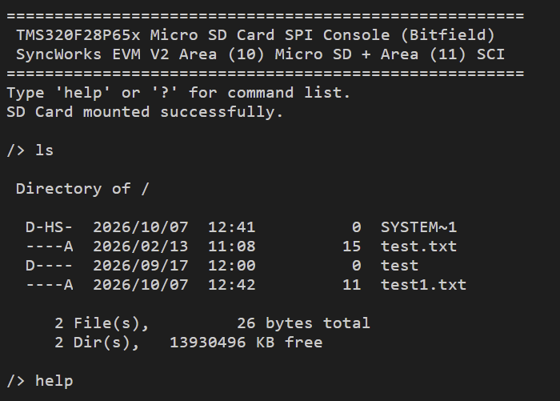

# Micro SD 카드 (SPI) 대화형 콘솔 — TMS320F28P65x DriverLib + FreeRTOS 버전

**요약**
- 개발보드 V2의 **(10) Micro SD 카드 슬롯(SPI)** 을 FatFs로 마운트하고, **(11) SCI-to-USB**로 PC 터미널에서 `ls`, `cat`, `write`, `mkdir`, `rm` 같은 명령으로 SD 카드를 다룹니다.
- DriverLib 기반에 **FreeRTOS(정적 할당, 힙 없음)** 를 얹어 콘솔·하트비트·디스크 타이머를 태스크 3개로 나눴습니다.
- 같은 동작을 [DriverLib 버전](../10_SD_Card_SPI_Driverlib/), [비트필드 버전](../10_SD_Card_SPI_Bitfield/)으로도 제공합니다(비교표는 아래).

## 1. 하드웨어 배선

### 1.1 (10) Micro SD 슬롯 ↔ F28P65x 모듈 (B-Side CN9001)

| EVM V2 (10) SD 슬롯 핀 | 신호 | F28P65x 모듈 핀 (B-Side) | GPIO | DriverLib 핀 설정 |
|---|---|---|---|---|
| **DI** | MOSI | **B-Side 45번** | GPIO50 | `GPIO_50_SPIC_PICO` |
| **DO** | MISO | **B-Side 43번** | GPIO51 | `GPIO_51_SPIC_POCI` |
| **CLK** | SPICLK | **B-Side 41번** | GPIO52 | `GPIO_52_SPIC_CLK` |
| **CS** | Chip Select | **B-Side 39번** | GPIO53 | 일반 GPIO 출력(Low 활성) |

SD 카드 전원(3.3V, GND)은 보드가 슬롯에 직접 공급하므로 데이터 4선만 연결합니다.

### 1.2 (11) SCI-to-USB ↔ F28P65x 모듈 (A-Side CN9000)

| EVM V2 (11) 핀 | 방향 | F28P65x 모듈 핀 (A-Side) | GPIO |
|---|---|---|---|
| **RX1** | PC → DSP | **A-Side 91번** | GPIO13 (SCIA_RX) |
| **TX1** | DSP → PC | **A-Side 89번** | GPIO12 (SCIA_TX) |

터미널은 **115200 8N1, 흐름 제어 없음**.

## 2. SD 카드 준비

Micro SD/SDHC(4~32GB 권장), **FAT16 또는 FAT32**(exFAT/NTFS 미지원)로 포맷. 루트에 텍스트 파일을 넣어 두면 `cat`으로 바로 확인할 수 있습니다.

## 3. 명령어

| 명령 | 설명 | 예 |
|---|---|---|
| `help`, `h`, `?` | 명령어 목록 | `help` |
| `ls` | 현재 디렉터리 목록, 파일 수, 남은 용량 | `ls` |
| `pwd` | 현재 경로 | `pwd` |
| `cd`, `chdir` | 디렉터리 이동(`..` 상위, `/` 루트. 루트에서 `..`는 루트 유지) | `cd logs` |
| `cat` | 텍스트 파일 출력 | `cat readme.txt` |
| `write` | 파일에 텍스트 쓰기(없으면 생성) | `write log.txt hello world` |
| `mkdir` | 디렉터리 생성 | `mkdir data` |
| `rm` | 파일 또는 빈 디렉터리 삭제 | `rm log.txt` |
| `uptime` | **(FreeRTOS 전용)** RTOS 틱 시간과 하트비트 카운터 | `uptime` |

## 4. FreeRTOS 구성

| 태스크 | 우선순위 | 스택(워드) | 하는 일 |
|---|---|---|---|
| `DiskTimerTask` | 3 (최고) | 128 | 10ms마다 `disk_timerproc()` 호출 → SD/FatFs 타임아웃 카운터 감소 |
| `HeartbeatTask` | 2 | 128 | 500ms마다 `heartbeatCount++` (CCS Expressions로 관찰) |
| `ConsoleTask` | 1 | 768 | 배너, SD 마운트, 명령어 쉘. 입력을 기다리는 동안 `vTaskDelay(1ms)`로 CPU 양보 |
| Idle | 0 | 128 | FreeRTOS 기본 |

- **정적 할당만** 씁니다(`configSUPPORT_STATIC_ALLOCATION=1`, 동적 할당 0). 태스크 스택은 `.freertosStaticStack` 섹션(RAMD0/RAMD1)에 둡니다.
- 틱은 CPU Timer2(1 kHz). SD 카드 대기 루프(`wait_ready` 등)는 ConsoleTask를 붙잡고 있어도 우선순위 높은 `DiskTimerTask`가 틱에서 선점해 타임아웃을 진행시킵니다.
- FatFs는 ConsoleTask 하나만 사용하므로 별도 잠금(뮤텍스)은 없습니다. 다른 태스크에서 SD를 쓰게 만들 때는 FatFs 접근에 뮤텍스를 추가해야 합니다.
- **ConsoleTask 스택 추정**: 컴파일된 어셈블리의 함수별 스택 프레임으로 구한 최악 경로(`Cmd_write` → `UARTprintf` → `UARTvprintf`(256워드 버퍼) → `uvsnprintf`)가 약 370~400워드이고, 컨텍스트 저장·인터럽트 여유를 더해도 약 500워드입니다. 768워드는 약 35% 여유입니다. `configCHECK_FOR_STACK_OVERFLOW=2`이므로 넘치면 `vApplicationStackOverflowHook`에 걸립니다(CCS에서 브레이크포인트를 걸어 두세요).
- **링커**: 코드가 커서 RAM 구성은 `.text`를 RAMLS0~3→RAMD0 순으로 채워 RAMD1을 정적 스택에 남기고, `.bss`/`.const`는 RAMLS5~7에 나눠 담습니다.

## 5. 소프트웨어 구조

| 파일 | 역할 |
|---|---|
| `10_SD_Card_SPI_Freertos.c` | 태스크 3개, 명령어 핸들러, FreeRTOS 훅(스택 오버플로, Idle 메모리) |
| `mmc_F28P65x.c` | DriverLib SPI-C SD 드라이버(표준 SPI 모드 3, 400 kHz → 12.5 MHz) |
| `utils/uartstdio.c` | SCI-A 콘솔. `UARTgetc`가 입력이 없으면 CPU를 양보하도록 수정됨 |
| `fatfs/`, `utils/cmdline.c`, `ustdlib.c` | FatFs, 명령행 파서, 경량 printf |
| `FreeRTOS/`, `FreeRTOSConfig.h` | FreeRTOS 커널(list/queue/tasks)과 C28x 포트 (`11_SCI_to_USB_Freertos`와 같은 구성) |
| `driverlib.lib`, `device/` | F28P65x DriverLib 사전 빌드 라이브러리와 헤더 |

## 6. 빌드·실행

1. CCS에서 `File > Import > CCS Projects`로 이 폴더의 `CCS/`를 지정해 `10_SD_Card_SPI_Freertos`를 가져옵니다.
2. 구성 선택: **CPU1_RAM** 또는 **CPU1_FLASH**.
3. Build → Debug → Run, 터미널에서 `help`, `uptime`을 입력합니다. `ls`처럼 SD를 읽는 동안에도 `heartbeatCount`가 계속 오르는지 Expressions에서 확인하면 멀티태스킹이 보입니다.

### 실행 화면

(11) SCI-to-USB로 연결한 PC 터미널(CCS의 Serial Console, 115200 8N1)에 나온 화면입니다. COM 번호는 PC마다 다릅니다. 이 화면은 [비트필드 버전](../10_SD_Card_SPI_Bitfield/)에서 캡처한 것이고, 이 버전은 배너 제목 줄이 `... Micro SD Card SPI Console (FreeRTOS)`로 다르고 `uptime` 명령이 더 있습니다. 명령과 출력 형식은 같습니다.

- **부팅 배너와 `SD Card mounted successfully.`**: SCI-A 콘솔(A-Side GPIO12/13)이 살아 있고 `f_mount`가 끝났다는 뜻입니다. `f_mount`는 FatFs에 드라이브를 등록만 하고 카드에는 접근하지 않으므로, 이 문구만으로는 카드 통신을 확인한 것이 아닙니다. 카드 초기화는 첫 명령(`ls`)에서 일어나며, 실패하면 `FR_NOT_READY`가 나옵니다.
- **`ls` 결과**: 카드에서 루트 디렉터리를 읽어 한 줄에 `속성  날짜  시간  크기  이름` 순으로 보여 줍니다. 속성 문자는 `D` 디렉터리, `R` 읽기 전용, `H` 숨김, `S` 시스템, `A` 보관이고 해당하지 않으면 `-`입니다. `SYSTEM~1`은 Windows가 카드에 만든 `System Volume Information` 폴더의 짧은 이름입니다.
- **합계 줄**: `2 File(s), 26 bytes total`은 `test.txt`(15바이트)와 `test1.txt`(11바이트)의 합이고, `2 Dir(s)`는 폴더 수, 마지막은 남은 용량(KB)입니다.
- **날짜**: 이 예제는 RTC가 없어 `get_fattime()`이 고정값 2026-09-17 12:00을 돌려줍니다. 보드에서 `write`/`mkdir`로 만든 항목은 항상 이 시각으로 기록되고, 화면의 `test` 폴더가 이 시각과 같습니다. PC에서 만든 항목은 실제 시각으로 보입니다.

## 7. 검증 상태

- **확인함(2026-10-05)**: CCS 임포트·빌드를 흉내 낸 빌드로 **CPU1_RAM, CPU1_FLASH 모두 오류 없이 링크**. `ff.c`의 열거형 혼용 경고는 `(FRESULT)` 캐스트로 없앴습니다. 핀 변경(SPI=B-Side, SCI=A-Side)과 SD 명령 끝 비트 수정 후에도 같은 방식으로 재확인했고(아래 빌드 결과), 실제 보드 동작은 확인 전입니다. ConsoleTask 스택은 위와 같이 추정으로 확인했습니다.
- **확인 전**: 실제 보드에 SD 카드를 꽂은 동작, FreeRTOS 스케줄링과 `uptime` 출력, 12.5 MHz 안정성.
- 점퍼선이 길어 12.5 MHz에서 오류가 나면 `mmc_F28P65x.c`의 `set_max_speed()` 속도를 7 MHz나 5 MHz로 낮춰 보세요.

## 8. 세 버전 비교

| 버전 | 폴더 | 핵심 차이 | RAM 구성 사용량 | FLASH 구성 사용량 |
|---|---|---|---|---|
| 비트필드 | [10_SD_Card_SPI_Bitfield](../10_SD_Card_SPI_Bitfield/) | 레지스터 직접 조작, DriverLib 없음 | 16,922 워드 | Flash 12,964 / RAM 3,966 |
| DriverLib | [10_SD_Card_SPI_Driverlib](../10_SD_Card_SPI_Driverlib/) | TI 표준 HAL 함수, 타이머 인터럽트 | 17,748 워드 | Flash 14,733 / RAM 3,717 |
| **FreeRTOS(이 폴더)** | 10_SD_Card_SPI_Freertos | 태스크 3개, 정적 할당 | 20,334 워드 | Flash 16,878 / RAM 4,150 |

링크 맵의 영역별 사용량 합계(워드)입니다. 측정: 2026-10-07, C2000 CGT 25.11.1.LTS(`--opt_level=off`), CCS 빌드와 같은 옵션으로 링크한 맵 기준입니다(비트필드판 RAM 구성은 CCS가 만든 `CPU1_RAM` 맵 18,179워드[sddiag 포함]와 일치함을 확인). FLASH 구성의 Flash는 `FLASH_BANK0`(131,070워드) 대비 비트필드 약 9.9%, DriverLib 약 11.2%, FreeRTOS 약 12.9%입니다. RAM 합계에는 PIE 벡터 테이블·주변장치 프레임 영역(약 480워드)도 들어 있습니다. RAM 구성은 코드까지 RAM에 올라가므로 크고, 스택(0x800)과 DriverLib 판의 힙 예약(0x800)이 포함됩니다.

## 관련 링크
- 상품 페이지: https://tms320f28x.co.kr/goods/goods_view.php?goodsNo=200903127
- 게시판 글: https://tms320f28x.co.kr/board/view.php?bdId=tms320f28xevmv2&sno=113
